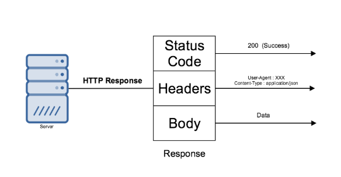

# Protocol of the Web

On the world-wide web where web pages are served, the main transmission protocol is **HTTP, or Hyper-Text Transfer Protocol**. Due to its ubiquity and familiarity to developers , many companies choose to adopt it as the underlying protocol for their RESTful API.

HTTP are made up of several components

### HTTP Request


#### URL

URL \(Uniform Resource Locator\) is a web address that reference to a web **resource.**  Additionally, it specify the mechanism \(HTTP, FTP for example\) that retrieve this particular resource.  URLs are made for resources like web pages and images, and API extend it even further by including nouns like Customers and Products. This allow API consumers to tell the server which resource it want to consume.

#### Methods

The request method tells the server what kind of action it want to undertake on the particular resource.

The most common HTTP methods are

* **GET** - Get a resource
* **POST** - Create a resource
* **PUT** - Update a resource
* **DELETE** - Delete a resource

#### Headers

Headers provide meta information about the HTTP request. It consists of simple information like what time the request was sent , size of the request body, to more complicated ones like Authorisation.

```text
GET /docs/index.html HTTP/1.1
Host: www.example.com
Accept: image/gif, image/jpeg, */*
Accept-Language: en-us
Accept-Encoding: gzip, deflate
User-Agent: Mozilla/4.0 (compatible; MSIE 6.0; Windows NT 5.1)
(blank line)
```

#### Body

The request body consists of data that are meant for the server. For example, the body will contains your personal information like name and email when you are first-time registering for a e-commence site. 

```text
POST /users/register HTTP/1.1
Host: www.example.com

{
 "name" : "Jack"
 "email" : "Jack@example.com"
}
```

Unlike the URL,Headers and HTTP Methods that requires a rigid structure, the body allows the client to send anything it needs.

### HTTP Response



After the server processed the request, it will return a response. The response is similar to the corresponding request, with only an additional status code.

#### Status Code

Status code are 3 digit numbers with unique meaning. If designed correctly, this numbers will provide useful information to the API consumers. 

Detailed explanation can be found [here](restful-api-design-principles/http-response-code.md) about designing the correct HTTP code when handling response.

Additionally, you can also e refer to[ REST API Design](restful-api-design-principles/) section for more in depth discussion of good design principles for API based on HTTP.

